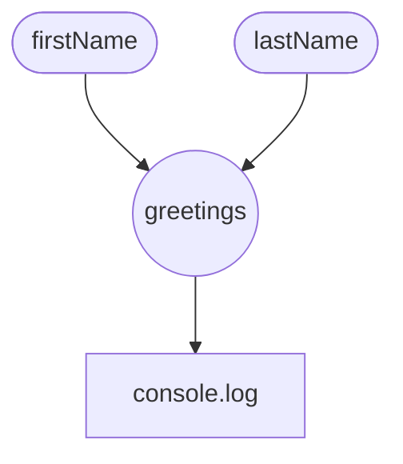
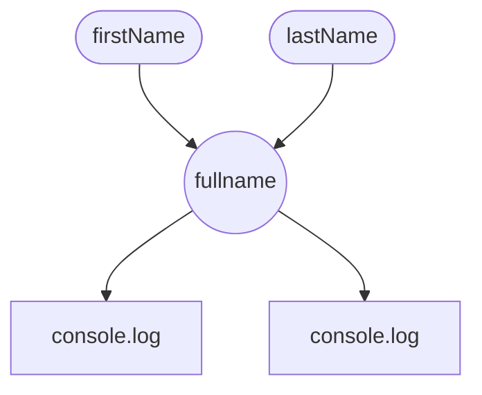
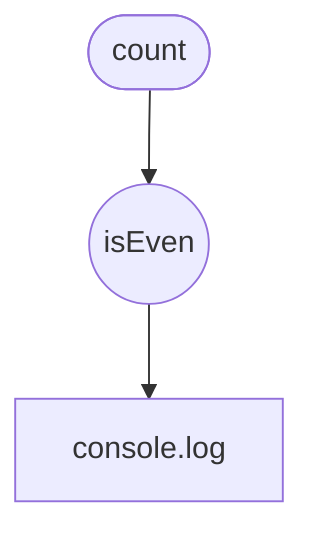
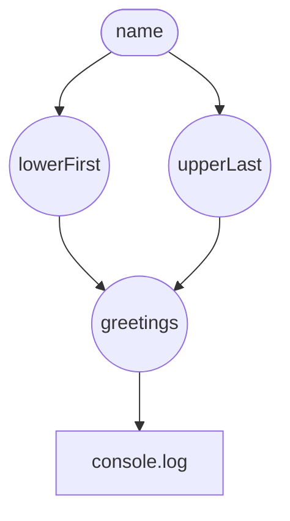

# Reactivity from scratch

## Pierre Robillard

### Touraine Tech - 2026/02/12

<div style="left: 0px;padding: 20px;position: absolute;bottom: 0px;width: 100%;display: flex;justify-content: space-between;">


</div>
---

# Qui suis-je ?

<v-clicks depth="2">

- Développeur fonctionnel
  - Backend (NodeJS) / Front-end (Web)
- Rejoint les Code-Troopers depuis 2018
  - Venez nous rencontrer 🍻

</v-clicks>

<div style="left: 0px;padding: 20px;position: absolute;bottom: 0px;width: 100%;display: flex;justify-content: space-between;">


</div>

---

# Signals ? Fined-grained reactivity ?

<v-clicks>

- La dernière hype des frameworks JS
- Solid.js, Vue, Angular, Preact...
- TC39 proposal (stage 1, August 2024)

</v-clicks>

<v-click at="4">
Mais c'est quoi la réactivité...
</v-click>

---

## 🍦 Vanilla JS UI

````md magic-move
```ts
const header = document.getElementById("hgreet")
const nameInput = document.getElementById("name")

nameInput.addEventListener("input", (e) => {
  header.textContent = `Hello, ${e.target.value}!`
})
```

```ts {3,9-11}
const header = document.getElementById("hgreet")
const firstNameInput = document.getElementById("fname")
const lastNameInput = document.getElementById("lname")

firstNameInput.addEventListener("input", (e) => {
  header.textContent = `Hello, ${e.target.value}!`
})

lastNameInput.addEventListener("input", (e) => {
  // ???
})
```

```ts {5-6,9,14}
const header = document.getElementById("hgreet")
const firstNameInput = document.getElementById("fname")
const lastNameInput = document.getElementById("lname")

let firstName: string = ""
let lastName: string = ""

firstNameInput.addEventListener("input", (e) => {
  firstName = e.target.value
  header.textContent = `Hello, ${firstName} ${lastName}!`
})

lastNameInput.addEventListener("input", (e) => {
  lastName = e.target.value
  header.textContent = `Hello, ${firstName} ${lastName}!`
})
```

```ts {8,12,17}
const header = document.getElementById("hgreet")
const firstNameInput = document.getElementById("fname")
const lastNameInput = document.getElementById("lname")

let firstName: string = ""
let lastName: string = ""

const greetings = () => `Hello, ${firstName()} ${lastName()}!`

firstNameInput.addEventListener("input", (e) => {
  firstName = e.target.value
  header.textContent = greetings()
})

lastNameInput.addEventListener("input", (e) => {
  lastName = e.target.value
  header.textContent = greetings()
})
```
````

<!--
partons de la base, comment on fait une interface web sans framework ?
[click]
complexifions légèrement l'exemple on ajoute un deuxième input
comment gérer le deuxième event listener, garder la mémoire
[click]
on introduit deux variables
[click]
on refactor pour éviter la répétition
-->

---
layout: two-cols-header
---

## 🦕 Les primitives réactives

::left::

<!-- On écrit plus nos app comme ça, mais l'exemple nous montre les trois primitives pour faire des UI interactives --->

```ts {|5-6,11,16|8|12,17|5-6,11,16|8|12,17}
const header = document.getElementById("hgreet")
const firstNameInput = document.getElementById("fname")
const lastNameInput = document.getElementById("lname")

let firstName: string = ""
let lastName: string = ""

const greetings = () => `Hello ${firstName()} ${lastName()}!`

firstNameInput.addEventListener("input", (e) => {
  firstName = e.target.value
  header.textContent = greetings()
})

lastNameInput.addEventListener("input", (e) => {
  lastName = e.target.value
  header.textContent = greetings()
})
```

::right::


<v-click at="1">

1. Des données que l'utilisateur peut lire & modifier

</v-click>
<v-click at="4">

  - **Signals** (Observable, state...)

</v-click>

<v-click at="2">

2. Des données qui sont dérivés d'autres données

</v-click>

<v-click at="5">

  - **Derivations** (Computations, memos...)

</v-click>

<v-click at="3">

3. Des effets de bords qui dépendent de données

</v-click>

<v-click at="6">

  - **Effects**

</v-click>

---

## Reactive reimplementation

````md magic-move
```ts
import { createSignal, createEffect, createComputed } from "./reactivity"

const header = document.getElementById("hgreet")
const firstNameInput = document.getElementById("fname")
const lastNameInput = document.getElementById("lname")

const [firstName, setFirstName] = createSignal("Luke")
const [lastName, setLastName] = createSignal("Skywalker")

firstNameInput.addEventListener("input", (e) => {
  setFirstName(e.target.value)
})
lastNameInput.addEventListener("input", (e) => {
  setLastName(e.target.value)
})

const greetings = createComputed(() => `Hello ${firstName()} ${lastName()}!`)

createEffect(() => {
  header.textContent = greetings()
})
```

```ts
import { createSignal, createEffect, createComputed } from "./reactivity"

const [firstName, setFirstName] = createSignal("Luke")
const [lastName, setLastName] = createSignal("Skywalker")

const greetings = createComputed(() => `Hello ${firstName()} ${lastName()}!`)

createEffect(() => {
  console.log(greetings())
})

setFirstName("Leila")
```
````

<!--
Réecrivons notre précdent exemple avec nos trois nouvelles primitives réactives
[click]
Pour alléger la lecture, on enlève la manipulation du DOM et on fait du console.log
-->

---

## Reactive reimplementation

```ts {monaco-run}
import { createSignal, createEffect, createComputed } from "./reactivity"

const [firstName, setFirstName] = createSignal("Luke")
const [lastName, setLastName] = createSignal("Skywalker")

const greetings = createComputed(() => `Hello ${firstName()} ${lastName()}!`)

createEffect(() => {
  console.log(greetings())
})

setFirstName("Leila")
```

---

## Lib implementation

````md magic-move
```ts
type Signal<T> = [getter: () => T, setter: (val: T) => void]

export function createSignal<T>(value: T): Signal<T> {
  const read = () => {
    return //...
  }
  const write = (nextVal: T) => {
    //...
  }
  return [read, write]
}
```

```ts {3,5,8}
type Signal<T> = [getter: () => T, setter: (val: T) => void]

export function createSignal<T>(value: T): Signal<T> {
  const read = () => {
    return value
  }
  const write = (nextVal: T) => {
    value = nextVal
  }
  return [read, write]
}
```

```ts {1,5,16-18}
type Effect = () => void
type Signal<T> = [getter: () => T, setter: (val: T) => void]

export function createSignal<T>(value: T): Signal<T> {
  const subscribers = new Set<Effect>()

  const read = () => {
    return value
  }
  const write = (nextVal: T) => {
    value = nextVal
  }
  return [read, write]
}

export function createEffect(fn: Effect) {
  //...
}
```

```ts {8-20}
type Effect = () => void
type Signal<T> = [getter: () => T, setter: (val: T) => void]

export function createSignal<T>(value: T): Signal<T> {
  // ...
}

const context: Effect[] = []

export function createEffect(fn: Effect) {
  const execute = () => {
    context.push(execute)
    try {
      fn()
    } finally {
      context.pop()
    }
  }
  execute()
}
```

```ts {8-10,15}
type Effect = () => void
type Signal<T> = [getter: () => T, setter: (val: T) => void]

export function createSignal<T>(value: T): Signal<T> {
  const subscribers = new Set<Effect>()

  const read = () => {
    if (context.at(-1)) {
      subscribers.add(context.at(-1)!)
    }
    return value
  }
  const write = (nextVal: T) => {
    value = nextVal
    subscribers.forEach((sub) => sub())
  }
  return [read, write]
}

const context: Effect[] = []

export function createEffect(fn: Effect) {
  // ...
}
```

```ts {14-16}
type Effect = () => void
type Signal<T> = [getter: () => T, setter: (val: T) => void]

export function createSignal<T>(value: T): Signal<T> {
  // ...
}

const context: Effect[] = []

export function createEffect(fn: Effect) {
  // ...
}

export function createComputed<T>(fn: () => T): () => T {
  return // ...
}
```

```ts {14-16}
type Effect = () => void
type Signal<T> = [getter: () => T, setter: (val: T) => void]

export function createSignal<T>(value: T): Signal<T> {
  // ...
}

const context: Effect[] = []

export function createEffect(fn: Effect) {
  // ...
}

export function createComputed<T>(fn: () => T): () => T {
  return fn
}
```
````

<!--
Faison l'implémentation de notre librairie réactive
Commençons par définir les interfaces de nos signals
A la base ce n'est que un getter/setter sur une valeur, ici un tuple
[click]
On doit commencer par retourner cette valeur, et être capable de la modifier
[click]
Mais pour être réactif, le signal doit garder la liste des effets qui sont dépendent
afin d'être capable de les notifiers quand une valeur change
[click]
On introduit une stack global d'effets, une stack de context réactive
Le but de createEffect est de wrapper nos effets de bords dans une fonction
d'ajouter ce wrapper à la stack, d'éxécuter l'effet de bord puis de l'enlever de la stack
[click]
Quand on lit la valeur d'un signal à lintérrieur d'un effet, on ajoute le dernier effet en cours dans la stack des context à la liste des subcriber
Quand on écrit la valeur d'un signal on peut notifier les subcribers pour les réexecuter
[click]
La dernière pièce du puzzle notre createComputed
[click]
On reste simple pour le moment
-->

---
layout: two-cols-header
---

## On l'a fait !

::left::

```ts
type Effect = () => void
type Signal<T> = [() => T, (val: T) => void]

export function createSignal<T>(value: T): Signal<T> {
  const subscribers = new Set<Effect>()

  const read = () => {
    if (context.at(-1)) {
      subscribers.add(context.at(-1)!)
    }
    return value
  }
  const write = (nextVal: T) => {
    value = nextVal
    subscribers.forEach((sub) => sub())
  }
  return [read, write]
}
```

::right::


```ts
const context: Effect[] = []

export function createEffect(fn: Effect) {
  const execute = () => {
    context.push(execute)
    try {
      fn()
    } finally {
      context.pop()
    }
  }
  execute()
}

export function createComputed<T>(fn: () => T): () => T {
  return fn
}
```

---
layout: two-cols-header
---
## On l'a fait !

::left::

Mais qu'est-ce qu'on a fait exactement ?

<v-clicks depth="2">

- On a construit un graphe réactif (DAG)
- Entièrement au runtime
  - Pas de compilateur
- Avec de l'autotracking
  - Pas de "dependencies array"
- Pas de règles de hooks
  - Nested effect
- "Eager" / "push" architecture

</v-clicks>


::right::

<v-click at="1">



</v-click>

---
layout: two-cols-header
---

## Edge case 1

::left::

```ts {monaco-run}
import { createSignal, createComputed, createEffect } from "./reactivity"

const [firstName, setFirstName] = createSignal("Annakin")
const [lastName, setLastName] = createSignal("Skywalker")

const fullName = createComputed(() => {
  // console.log("...⚙️ doing hard work ...")
  return `${firstName()} ${lastName()}`
})

createEffect(() => console.log(`Hello ${fullName()} !`))
// createEffect(() => console.log(`Goodbye ${fullName()} !`))

setFirstName("Darth")
```

::right::

<v-click>


</v-click>

<style>
.two-cols-header {
  display: grid;
  grid-template-columns: 2fr 1fr;
  grid-template-rows: auto 1fr auto;
}
</style>

---

## Edge case 1 - Le fix ?


````md magic-move

```ts
export function createComputed<T>(fn: () => T): () => T {
  return fn
}
```

```ts
export function createComputed<T>(fn: () => T): () => T {
  const [read, write] = createSignal(fn())

  createEffect(() => {
    write(fn())
  })

  return read
}
```

````

---
layout: two-cols-header
---

## Edge case 1 - Le fix ?

::left::

```ts {monaco-run}
import { createSignal, createComputed, createEffect } from "./reactivity-v2"

const [firstName, setFirstName] = createSignal("Annakin")
const [lastName, setLastName] = createSignal("Skywalker")

const fullName = createComputed(() => {
  console.log("... ⚙️ doing hard work ...")
  return `${firstName()} ${lastName()}`
})

createEffect(() => console.log(`Hello ${fullName()} !`))
createEffect(() => console.log(`Goodbye ${fullName()} !`))

setFirstName("Darth")
```

::right::



<style>
.two-cols-header {
  display: grid;
  grid-template-columns: 2fr 1fr;
  grid-template-rows: auto 1fr auto;
}
</style>

---
layout: two-cols-header
---

## Edge case 2

::left::


```ts {monaco-run}
import { createSignal, createComputed, createEffect } from "./reactivity-v2"

const [count, setCount] = createSignal(0)

const isEven = createComputed(() => count() % 2 === 0)

createEffect(() => {
  console.log(`Is it even? ${isEven()}`)
})

setCount(2)
setCount(4)
```

::right::

<v-click>



</v-click>

<style>
.two-cols-header {
  display: grid;
  grid-template-columns: 2fr 1fr;
  grid-template-rows: auto 1fr auto;
}
</style>

---

## Edge case 2 - Le fix ?

````md magic-move

```ts
export function createSignal<T>(value: T): Signal<T> {
  const subscribers = new Set<Effect>()

  const read = () => {
    if (context.at(-1)) {
      subscribers.add(context.at(-1)!)
    }
    return value
  }
  const write = (nextVal: T) => {
    value = nextVal
    subscribers.forEach((sub) => sub())
  }
  return [read, write]
}
```

```ts {11}
export function createSignal<T>(value: T): Signal<T> {
  const subscribers = new Set<Effect>()

  const read = () => {
    if (context.at(-1)) {
      subscribers.add(context.at(-1)!)
    }
    return value
  }
  const write = (nextVal: T) => {
    if (value === nextVal) return 
    value = nextVal
    subscribers.forEach((sub) => sub())
  }
  return [read, write]
}
```

````

---

## Edge case 2 - Le fix ?

```ts {monaco-run}
import { createSignal, createComputed, createEffect } from "./reactivity-v3"

const [count, setCount] = createSignal(0)

const isEven = createComputed(() => count() % 2 === 0)

createEffect(() => {
  console.log(`Is it even? ${isEven()}`)
})

setCount(2)
setCount(4)
```

---

## Edge case 3

```ts {monaco-run}
import { createSignal, createComputed, createEffect } from "./reactivity-v3"

const [name, setName] = createSignal({ first: "Luke", last: "Skywalker" })

const lowerFirst = createComputed(() => name().first.toLowerCase())
const upperLast = createComputed(() => name().last.toUpperCase())
const greetings = createComputed(() => `Hello, ${lowerFirst()} ${upperLast()} !`)

createEffect(() => {
  console.log(greetings())
})

setName({ first: "Darth", last: "Vader" })
```

<!-- Un glitch / état intermédiare  -->
---
layout: center
---

# Diamond problem 💎



<!-- Le graphe est évalué en "depth first", branche de gauche et branche de droite -->
---

## Le fix ?

<v-clicks depth="2">

- Soit on revient à une simple fonction pour *createComputed*.
- Soit on passe à une architecture **Push-pull** en deux phases :
  1.  *notification* on marque les noeud comme *dirty*
  2.  *execution* on effectue les calculs dans l'ordre

</v-clicks>

<!-- 
Pas simple
[click]
Mais dans ce cas le edge case 1 revient
[click]
Pas un seul algo "Push/pull". Différentiation des librairies.
 -->
---

## Crédit et références :

La plupart des idées ne sont pas originales, c’est le mix de plusieurs autres par des personnes plus brillantes que moi, le crédit leur revient :

- **Dan Jutan** - Simplifying reactivity with solidJS
  - [https://youtu.be/qB5jK-KeXOs]()
- **Milo Mighdoll** - Reactively
  - [https://github.com/milomg/reactively/blob/main/Reactive-algorithms.md]()
- **Damien Chazoule** - WTF is Reactivity
  - [https://dev.to/dmnchzl/wtf-is-reactivity--4c1h]()
- **Ryan Carniato** - Building a Reactive Library from Scratch
  - [https://dev.to/ryansolid/building-a-reactive-library-from-scratch-1i0p]()

**Pour approfondir, allez voir la conf d'Esteban, aujourd'hui 15h45 même amphi**

---
layout: center
---

## Openfeedback


[https://github.com/age2pierre/tnt26-slidev]()
